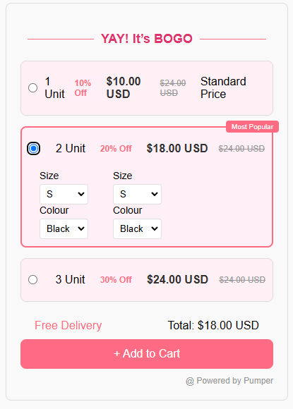

# BOGO Product Selection

A stylish and interactive product selection interface that allows users to choose between purchasing 1, 2, or 3 units, with dynamic options for size and color selection. This project includes responsive and visually engaging styling for an enhanced user experience.

## Features

- **Selectable Unit Options**: 
  - Users can choose between 1, 2, or 3 units. Selecting a unit expands the relevant box, displaying additional options for that selection while collapsing the others.
  
- **Size and Color Selection**: 
  - In expanded boxes, dropdowns allow users to select the size and color for each item.

- **Interactive Styling**: 
  - The selected box is highlighted with a custom background color (`#e0336e`) and a border color (`#FF6B82`).
  - Unselected boxes revert to a white background.
  - "Free Delivery" text is aligned to the left, and the "Total Price" is aligned to the right for clear visual separation.
  - Title styling includes decorative lines: `---------- YAY! It’s BOGO ----------`.

- **Responsive Design**: 
  - Optimized for desktop and mobile devices for a smooth user experience on any screen size.

## Technologies Used

- **HTML** for structure.
- **CSS** for styling and animations.
- **JavaScript** for functionality (expanding/collapsing boxes and dynamically updating selection).

## Preview

> _Add a screenshot of the project here if available_

## Getting Started

### Prerequisites

To run this project, you’ll need a modern web browser.
